```{r setup, include=FALSE}
## Global options
knitr::opts_chunk$set(cache = FALSE,
                      echo = FALSE)

library(tidyverse)
library(fmsb)
```

```{r data, include=FALSE}
main = read.csv("data//fe8CharData.csv")
rownames(main) = main$X
main = main %>% select(-1)

bases = read.csv("data//fe8Bases.csv")
rownames(bases) = bases$X
bases = bases %>% select(-1)

growths = read.csv("data//fe8Growths.csv")
rownames(growths) = growths$X
growths = growths %>% select(-1)


# Bases
bases_n <- bases %>% select(c(3:9))

max = c()
min = c()
for(i in c(1:length(bases_n[1,]))){
  max = append(max,max(bases_n[,i]))
  min = append(min,min(bases_n[,i]))
}

max_min_bases <- rbind(min,bases_n) %>% 
  rbind(max,.)
rownames(max_min_bases)[c(1,2)] = c("Max","Min")
rm(max,min,i,bases_n)
max_min_bases <- max_min_bases[,c(1,6,7,5,4,3,2)]


# Growths
noOutlier = growths[-32,]

max = c()
min = c()
for(i in c(1:length(noOutlier[1,]))){
  max = append(max,max(noOutlier[,i]))
  min = append(min,min(noOutlier[,i]))
}

max_min_growths <- rbind(min,growths) %>% 
  rbind(max,.)
rownames(max_min_growths)[c(1,2)] = c("Max","Min")
rm(max,min,i,noOutlier)
max_min_growths <- max_min_growths[,c(1,6,7,5,4,3,2)]


# Character Stats
CStats = main %>% 
  summarise(baseStats = Hp_b+7/2*SM_b+7/4*Skl_b+3*Spd_b+7/5*Lck_b+7/3*Def_b+7/3*Res_b,
            growthPotential = Lv_from_max/100*(Hp_g+7/2*SM_g+7/4*Skl_g+3*Spd_g+7/5*Lck_g+7/3*Def_g+7/3*Res_g)+
              (Hp_promo+7/2*SM_promo+7/4*Skl_promo+3*Spd_promo+7/3*Def_promo+7/3*Res_promo+Mov_promo),
            availability = avail,
            utility = (Mov+Mov_promo)/8+mov_bonus+2.5*buffs+extrautil+1/2*weapon_types,
            durability = 1*(Hp_b+Hp_g/200*Lv_from_max+Hp_promo)+1.25*(Def_b+Def_g/200*Lv_from_max+Def_promo)+
              1.3*(Res_b+Res_g/200*Lv_from_max+Res_promo)+1/4*(Spd_b+Spd_g/200*Lv_from_max+Spd_promo),
            offense = 2.5*(SM_b+SM_g/200*Lv_from_max+SM_promo+1/4*(Con+Con_promo))+
              .75*(Spd_b+Spd_g/200*Lv_from_max+Spd_promo)+2*weapon_types)

rownames(CStats) <- rownames(main)

max = c()
min = c()
for(i in c(1:length(CStats[1,]))){
  max = append(max,max(CStats[,i]))
  min = append(min,min(CStats[,i]))
}

max_min_CStats <- rbind(min,CStats) %>% 
  rbind(max,.)
rownames(max_min_CStats)[c(1,2)] = c("Max","Min")
rm(max,min,i)


max_min_CStats["Min","offense"] <- 40
max_min_CStats["Tethys","offense"] <- 40

```


```{r plotfn}
create_beautiful_radarchart <- function(data, color = "#00AFBB", 
                                        vlabels = colnames(data), vlcex = 1,
                                        caxislabels = NULL, title = NULL, ...){
  radarchart(
    data,
    # Customize the polygon
    pcol = color, pfcol = scales::alpha(color, 0.65), plwd = 2, plty = 1,
    cglty = 1,
    # Variable labels
    vlcex = vlcex, vlabels = vlabels,
    caxislabels = caxislabels, title = title, ...
  )
}


cplot <- function(name){
  layout(matrix(c(1,1,2,1,1,3), 2, 3, byrow = TRUE))
  create_beautiful_radarchart(max_min_CStats[c("Max","Min",name),],title=name,color=main[name,"char_colors"],
                              vlabels = c("Base Stats","Potential for Growth","Availability","Non-Combat Utility","Durability","Offensive Capability"))
  
  create_beautiful_radarchart(max_min_bases[c("Max","Min",name),],title="Bases",color="ivory4",
                              vlabels = c("HP","Def","Res","Lck","Spd","Skl","S/M"))
  
  create_beautiful_radarchart(max_min_growths[c("Max","Min",name),],title="Growths",color="gold2",
                              vlabels = c("HP","Def","Res","Lck","Spd","Skl","S/M"))
}
```

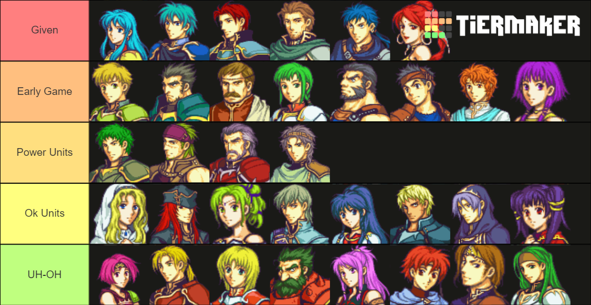

# Given Units


## Eirika  

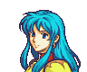{#id .class width=240px height=200px}
The princess of the kingdom of Renais. She's elegant and kind.


```{r Eirika Plot}
cplot("Eirika")
```

## Ephriam

{#id .class width=245px height=200px}
The prince of Renais. He is a man of great honor and bravery.


```{r Ephraim Plot}
cplot("Ephraim")
```


## Seth

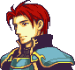{#id .class width=212px height=200px}
A young commander of Renais. He's calm, composed, and skilled.


```{r Seth Plot}
cplot("Seth")
```


## Colm
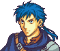{#id .class width=235px height=200px}
A childhood friend of Neimi who hails from Renais. He can be snide.


```{r Colm Plot}
cplot("Colm")
```


## Tethys

{#id .class width=187px height=200px}
A beautiful and charming dancer from Jehanna.


```{r}
cplot("Tethys")
```


# Early Game


## Franz

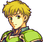{#id .class width=205px height=200px}
An earnest and compassionate cavalier from Renais.

```{r Franz Plot}
cplot("Franz")
```


## Gilliam

{#id .class width=243px height=200px}
An armored knight of Frelia. He's quiet yet dependable.


```{r Gilliam Plot}
cplot("Gilliam")
```


## Moulder

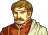{#id .class width=274px height=200px}
A mature priest of Frelia. He's gentle and reassuring.

```{r Moulder Plot}
cplot("Moulder")
```


## Vanessa

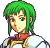{#id .class width=205px height=200px}
A sincere, honest, and honorable pegasus knight of Frelia.

```{r Vanessa Plot}
cplot("Vanessa")
```


## Garcia

{#id .class width=234px height=200px}
A villager from Renais. He was once a feared military leader.


```{r Garcia Plot}
cplot("Garcia")
```


## Ross

{#id .class width=234px height=200px}
A young villager. He longs to be a warrior, like his father.


```{r Ross Plot}
cplot("Ross")
```


## Artur

{#id .class width=207px height=200px}
A young monk from Renais. He is a very forthright and pious man.


```{r Artur Plot}
cplot("Artur")
```


## Lute

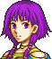{#id .class width=175px height=200px}
A young mage of Renais. She believes she is a prodigy.


```{r Lute Plot}
cplot("Lute")
```


# Power Units


## Kyle

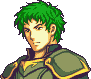{#id .class width=230px height=200px}
A steadfast and honorable cavalier in sworn service to Renais.


```{r Kyle Plot}
cplot("Kyle")
```


## Gerik

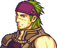{#id .class width=237px height=200px}
A mercenary leader from Jehanna. He's better known as the Desert Tiger.


```{r Gerik Plot}
cplot("Gerik")
```


## Duessel

{#id .class width=246px height=200px}
A courageous general in Grado's army. He's better known as Obsidian.


```{r Duessel Plot}
cplot("Duessel")
```


## Saleh

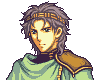{#id .class width=240px height=200px}
A sage from the village Caer Pelyn. He's Ewan's solemn, but kind, teacher.


```{r Saleh Plot}
cplot("Saleh")
```


# Ok Units


## Natasha

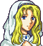{#id .class width=188px height=200px}
A beautiful cleric from the Grado Empire. She's graceful and serious.


```{r Natasha Plot}
cplot("Natasha")
```


## Joshua

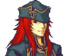{#id .class height=200px}
A wandering swordsman from Jehanna. He loves to gamble.

```{r Joshua Plot}
cplot("Joshua")
```


## LArachel

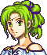{#id .class height=200px}
A young woman from Rausten. She fights for justice and order.

```{r LArachel Plot}
cplot("LArachel")
```


## Innes

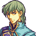{#id .class width=197 height=200px}
The prince of Frelia. He's brash and arrogant, but good at heart.


```{r Innes Plot}
cplot("Innes")
```


## Tana

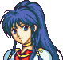{#id .class width=210px height=200px}
A young lady of Frelia. She is both cheery and sociable.


```{r Tana Plot}
cplot("Tana")
```


## Cormag

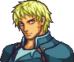{#id .class width=238px height=200px}
A wyvern knight of Grado. A gentle man, but a ferocious warrior.


```{r Cormag Plot}
cplot("Cormag")
```


## Knoll

{#id .class width=210px height=200px}
One of Grado's royal mages. He knows the riddle of the Dark Stone.


```{r Knoll Plot}
cplot("Knoll")
```


## Myrrh

{#id .class width=207px height=200px}
A young, pure-hearted girl from Darkling Woods. She tends to be shy.


```{r Myrrh Plot}
cplot("Myrrh")
```


# UH-OH


## Neimi

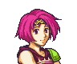{#id .class width=240px height=200px}
A childhood friend of Colm who hails from Renais. She cries a lot.


```{r Neimi Plot}
cplot("Neimi")
```


## Forde

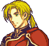{#id .class width=216px height=200px}
A cavalier from Renais. He is skilled, but reckless. He's Franz's brother.


```{r Forde Plot}
cplot("Forde")
```


## Amelia

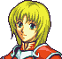{#id .class width=212px height=200px}
A young girl from a small village in Grado. She is honest and sincere.


```{r Amelia Plot}
cplot("Amelia")
```


## Dozla

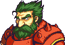{#id .class width=287px height=200px}
A berserker from Rausten. He's a hearty man with a thirst for life.


```{r Dozla Plot}
cplot("Dozla")
```


## Marisa

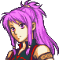{#id .class width=194px height=200px}
An aloof sword fighter from Jehanna. She's known as the Crimson Flash.


```{r Marisa Plot}
cplot("Marisa")
```


## Ewan

{#id .class width=222px height=200px}
A sage-in-training from Jehanna. He reveres his teacher, Saleh.


```{r Ewan Plot}
cplot("Ewan")
```


## Rennac

{#id .class width=154px height=200px}
A lazy, greedy, but exceptional fighter from the Republic of Carcino.


```{r Rennac Plot}
cplot("Rennac")
```


## Syrene

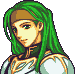{#id .class width=202px height=200px}
The dutiful commander of the 3rd battalion of Frelia's pegasus knights.


```{r Syrene Plot}
cplot("Syrene")
```


